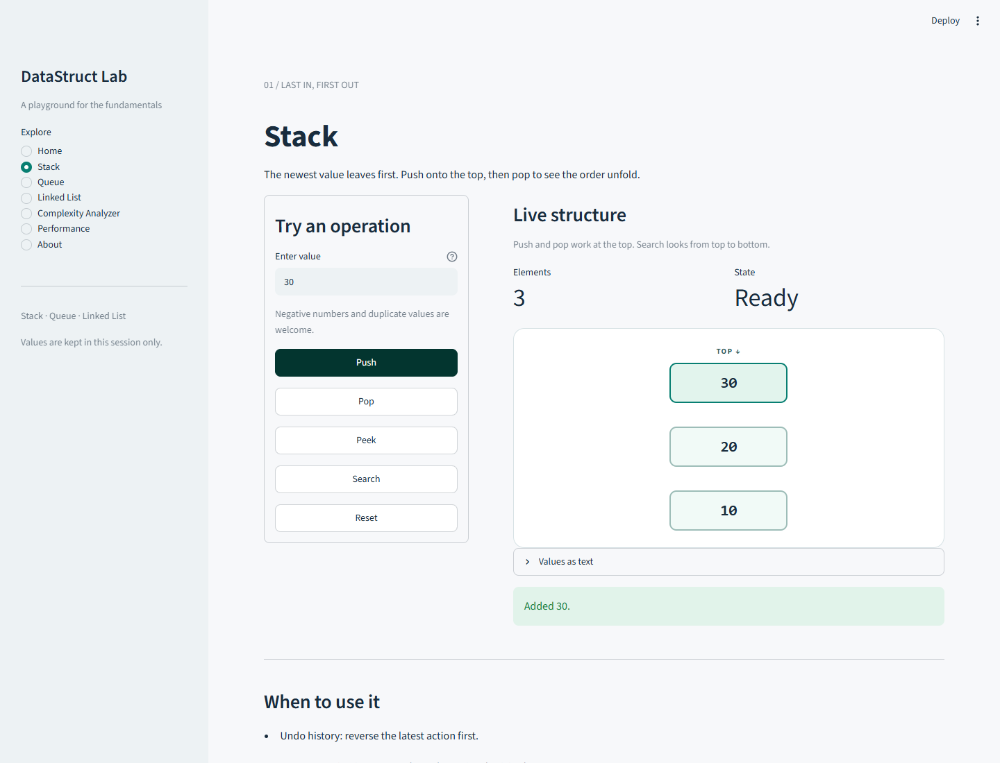
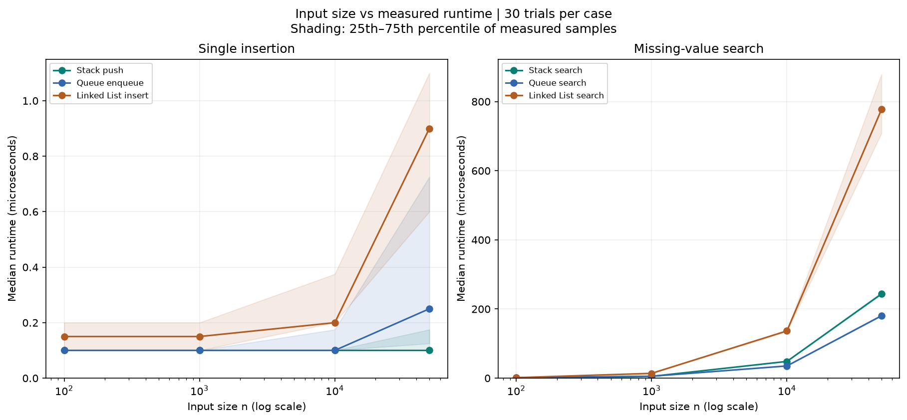
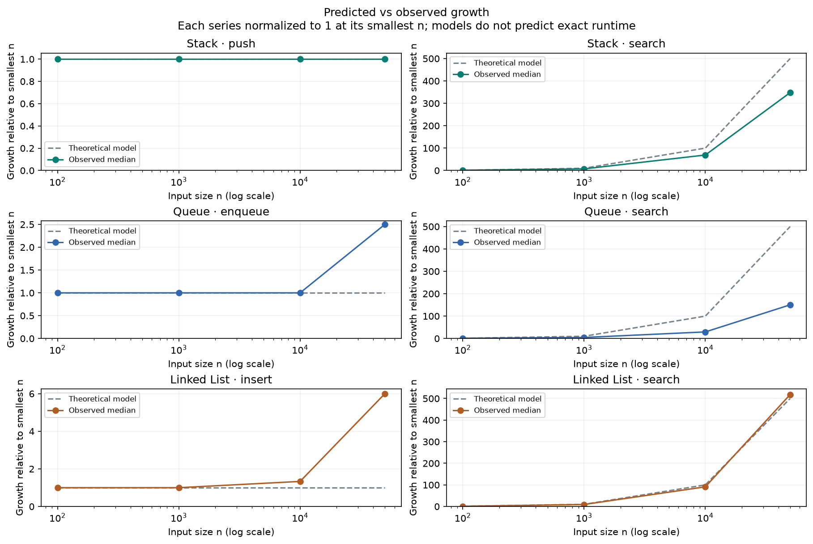

# datastruct-lab — Data Structure Learning Tool

## Overview

Learn how data structures store, find, and remove values through small Python
examples. `datastruct-lab` is for students and anyone practicing data structure
fundamentals. It began as a project for CSC506 Design and Analysis of Algorithms.

Start with a **Stack** to understand last in, first out (LIFO), or a **Queue** to
understand first in, first out (FIFO). Explore a **Linked List** to see how nodes
connect values without contiguous storage. Import any of the three classes,
experiment with their operations, and read the tests as examples of behavior.

**Day 7 — release preparation.** Explore live diagrams, compare complexity
predictions, and run repeated benchmarks with downloadable CSV data, charts,
and a report. The project has 128 passing tests.

## Features

Available now:

- Stack: `push`, `pop`, `peek`, `search`, `is_empty`, and `size`.
- Queue: `enqueue`, `dequeue`, `peek`, `search`, `is_empty`, and `size`.
- Linked List: `insert`, `delete`, `search`, `traverse`, `is_empty`, and `size`.
- Streamlit navigation, live diagrams, independent session state, and Reset.
- Integer input validation, operation feedback, and real-world use cases.
- Clear empty-operation errors, type hints, complexity docstrings, and tests.
- Complexity predictions for all 20 public operations, with explanations and
  an illustrative growth chart.

- Repeated benchmarks for six operation types, raw and summary CSV exports,
  environment metadata, runtime/growth charts, and a report bundle.

- A three-page analysis, documented implementations, selected test examples,
  and a recorded walkthrough with computer-generated narration.

See [requirements](docs/requirements.md) for operation contracts and acceptance
criteria and [the assignment plan](docs/assignment_plan.md) for the schedule.

## Technology

- Python; the Day 1 environment uses Python 3.14.
- Streamlit for the interface.
- pytest for automated tests.
- Matplotlib for charts and pandas for result tables.
- `time.perf_counter_ns()` for runtime measurements.
- Git and GitHub for version control.

## Installation

### Prerequisites

- Git to clone the repository.
- Python 3.14, the version used to verify this project. Other Python versions
  have not been verified with the pinned dependencies.

### Windows (PowerShell)

```powershell
git clone https://github.com/Shreyash2942/datastruct-lab.git
cd datastruct-lab
python -m venv .venv
.\.venv\Scripts\python.exe -m pip install -r requirements.txt
.\.venv\Scripts\python.exe -m pip check
```

### macOS / Linux

With Python 3.14 available as `python3`:

```bash
git clone https://github.com/Shreyash2942/datastruct-lab.git
cd datastruct-lab
python3 -m venv .venv
.venv/bin/python -m pip install -r requirements.txt
.venv/bin/python -m pip check
```

These commands use the virtual environment directly; activation is optional.
The project has been tested on Windows with Python 3.14.4. The macOS/Linux
commands are provided for those platforms but have not been tested there.

The full dependency file includes libraries for the interface and
charts. The three core data structure modules themselves use only Python's
standard library.

## Usage

### Launch the interactive lab

From the repository root, run:

```powershell
# Windows
.\.venv\Scripts\python.exe -m streamlit run app.py
```

```bash
# macOS / Linux
.venv/bin/python -m streamlit run app.py
```

Open the local URL printed by Streamlit (normally `http://localhost:8501`).
Press `Ctrl+C` in the terminal to stop the server.

No email or Streamlit account is needed to run the local lab. Project settings
disable Streamlit's first-run email prompt and usage statistics. Launch from
the repository root so Streamlit loads these settings.

1. Choose **Stack**, **Queue**, or **Linked List** in the sidebar.
2. Enter a whole number such as `10` or `-5` and click **Push**, **Enqueue**, or
   **Insert**. Duplicates are allowed.
3. Try removal, search, and peek or traversal. Watch the diagram and element
   count update. Linked-list **Delete** uses the value field and removes only
   the first matching node from the head.
4. Switch pages freely: each structure keeps independent state in this session.
5. Use **Reset** to empty only the selected structure.

Stack shows **TOP** vertically; Queue shows **FRONT** and **REAR**; Linked List
shows **HEAD**, node links, and the final **None** reference. The **Values as
text** panel provides the same contents in reading order. Large diagrams scroll.
Invalid input and empty operations show a friendly message without changing data.

State is temporary: a new or reloaded browser session starts fresh. Benchmarks
use separate fixtures and preserve the values in your live structures.



### Explore complexity

Open **Complexity Analyzer** and choose a **Data structure**, **Operation**, and
positive **Input size (n)**. Results update immediately. Try **Linked List →
Search → 10,000** to see O(n) search time, O(n) structure storage, and O(1)
auxiliary space. Then choose **Insert (at head)** to compare its O(1) time.

- Time bounds include best-case and worst single-operation behavior. Stack
  push/pop explicitly distinguish O(1) amortized cost from O(n) resizing.
- Space separates the existing structure, temporary auxiliary work, and the
  returned result. Traversal and snapshots produce O(n) result containers.
- The growth chart compares n, 2n, and 4n, normalized to 1 at the selected n.
  Its ratios illustrate a constant or linear model; they are not measured
  runtimes, exact instruction counts, or absolute speed comparisons.
- The UI accepts sizes from 1 through 1,000,000,000. It does not allocate those
  elements or change the contents of your live structures.

The same analyzer is available directly from Python:

```python
from src.analysis import analyze_complexity

prediction = analyze_complexity("Linked List", "search", 10_000)
print(prediction.rule.time)             # O(n)
print(prediction.storage_space)         # O(n)
print(prediction.rule.auxiliary_space)  # O(1)
print(prediction.growth_points)        # ((10000, 1), (20000, 2), (40000, 4))
```

Use `supported_structures()` and `supported_operations(structure)` from
`src.analysis` to list valid names. The API rejects unknown combinations and
nonpositive/noninteger sizes with `ValueError`, including booleans.
See [Day 5 notes](docs/day_5.md) for assumptions and verification.

### Start a Python session

Keep your terminal in the cloned `datastruct-lab` folder and start Python:

```powershell
# Windows
.\.venv\Scripts\python.exe
```

```bash
# macOS / Linux
.venv/bin/python
```

At the Python prompt, paste any example below. Type `exit()` to return to
your terminal. You can also save an example as a `.py` file in the repository
root and run it with the same virtual-environment Python command.

### Stack: last in, first out

A stack removes the most recently added value first. Think of an undo history:
the latest action is the first one you undo.

```python
from src.structures import Stack

stack = Stack[int]()
stack.push(10)
stack.push(20)
print(stack.peek())       # 20: look at the top without removing it
print(stack.pop())        # 20: remove the most recent value
print(stack.search(10))   # True: 10 is still present
print(stack.size())       # 1
print(stack.is_empty())   # False
```

### Queue: first in, first out

A queue removes the oldest value first. Think of a printer processing jobs in
the order they arrive.

```python
from src.structures import Queue

queue = Queue[int]()
queue.enqueue(10)
queue.enqueue(20)
print(queue.peek())        # 10: look at the front without removing it
print(queue.dequeue())     # 10: remove the oldest value
print(queue.search(20))    # True: 20 is still waiting
print(queue.size())        # 1
print(queue.is_empty())    # False
```

### Linked List: nodes connected from head to tail

Each node holds a value and a reference to the next node. Insertion at the head
does not require shifting existing values. Finding or deleting a value may
require walking through the list.

```python
from src.structures import LinkedList

linked = LinkedList[int]()
linked.insert(10)
linked.insert(20)
linked.insert(10)
print(linked.traverse())   # [10, 20, 10]: newest value is at the head
print(linked.search(20))   # True
print(linked.delete(10))   # True: remove only the first match from the head
print(linked.traverse())   # [20, 10]: the other 10 remains
print(linked.delete(99))   # False: missing values leave the list unchanged
print(linked.size())       # 2
print(linked.is_empty())   # False
```

`traverse()` returns a new Python list. Changing its entries does not change
the node chain. It is a shallow copy, so mutable values themselves are shared.

### Handle an empty structure

Stack and Queue removal and peek raise `IndexError` when there are no values.
Catch the exception if your program needs to display a message and continue:

```python
from src.structures import Stack

empty_stack = Stack[int]()
try:
    empty_stack.pop()
except IndexError as error:
    print(error)  # Cannot pop from an empty stack.
```

For an empty Linked List, `traverse()` returns `[]`, and `search()` and `delete()`
return `False`.

All three structures allow duplicate values. Search compares values for equality,
returns a boolean, and preserves the contents. Type hints such as `Stack[int]`
help editors and type checkers; they do not enforce value types at runtime.

### Operation reference

| Action | Stack | Queue | Return value | Time |
| --- | --- | --- | --- | --- |
| Add a value | `push(value)` | `enqueue(value)` | `None` | O(1) amortized for Stack; O(1) for Queue |
| Remove next value | `pop()` | `dequeue()` | Removed value | O(1) amortized for Stack; O(1) for Queue |
| View next value | `peek()` | `peek()` | Next value | O(1) |
| Find a value | `search(value)` | `search(value)` | `True` or `False` | O(n) worst case |
| Check emptiness | `is_empty()` | `is_empty()` | `True` or `False` | O(1) |
| Count values | `size()` | `size()` | Integer count | O(1) |

Here, n is the number of stored values. Stack uses a Python list; occasional
resizing can make a single push/pop O(n), while the average cost over a sequence
is O(1). Queue uses `collections.deque`. Both structures use O(n) storage.
Search costs assume constant-time equality comparisons.

For read-only display, `Stack.to_list()` returns a shallow snapshot from top to
bottom and `Queue.to_list()` from front to rear. Both take O(n) time and result
space; editing the returned container does not change the structure.

| Linked List operation | Return value | Time |
| --- | --- | --- |
| `insert(value)` | `None`; adds at the head | O(1) |
| `delete(value)` | `True` if the first match was removed; otherwise `False` | O(n) worst case |
| `search(value)` | `True` or `False` | O(n) worst case |
| `traverse()` | New list of values from head to tail | O(n) |
| `is_empty()` | `True` or `False` | O(1) |
| `size()` | Maintained integer count | O(1) |

Linked List uses O(n) storage; traversal also allocates O(n) space for its result.
Deletion and search use O(1) auxiliary space and assume constant-time equality.
`Node` is exported for studying its `data` and `next` attributes; normal usage
goes through `LinkedList` methods.

## Interface and Roadmap

Use the Streamlit lab or import the structures directly from Python.

| Milestone | Work | Status |
| --- | --- | --- |
| Day 1 | Project setup and requirements | Complete |
| Day 2 | Stack, Queue, initial tests | Complete |
| Day 3 | Linked List and expanded tests | Complete |
| Day 4 | Interactive Streamlit interface and diagrams | Complete |
| Day 5 | Complexity analyzer | Complete |
| Day 6 | Benchmarks, CSV results, and charts | Complete |
| Day 7 | Final analysis, documentation, demo video, and release | Materials prepared; title-page due date pending |

## Project Structure

```text
datastruct-lab/
├── app.py                # Streamlit entry point
├── .streamlit/config.toml # Theme and local app settings
├── README.md
├── requirements.txt
├── src/
│   ├── structures/
│   │   ├── stack.py      # LIFO implementation
│   │   ├── queue.py      # FIFO implementation
│   │   └── linked_list.py # Node and singly linked list
│   ├── analysis/         # Complexity rules and prediction API
│   ├── benchmark/        # Timing engine, CSV/chart/report generation
│   └── visualization/    # HTML structure diagrams
├── tests/                # Core, diagram, and Streamlit interaction tests
├── docs/                 # Plan, requirements, test plan, milestone status
├── demo/                 # Narrated walkthrough, transcript, captions, demo results
├── reports/              # Performance report and APA analysis with appendices
├── data/                 # Measured benchmark CSV output
└── images/               # Generated charts and screenshots
```

## Testing

Run the current suite from the repository root:

```powershell
.\.venv\Scripts\python.exe -m pytest
```

On macOS/Linux:

```bash
.venv/bin/python -m pytest
```

The [selected test cases](docs/selected_test_cases.md) highlight three existing
checks per structure, with inputs, expected outcomes, and commands to run them.
The full suite is retained.

The current suite contains 128 passing tests: 23 core cases, 9 diagram/snapshot
cases, 21 Streamlit interaction cases, 48 complexity cases, and 27 benchmark cases. To run one area,
append a test file such as `tests/test_complexity.py`, `tests/test_visualizer.py`,
or `tests/test_app.py` to the command.

The suite covers ordering, duplicates, empty-operation errors, successful
and missing searches, non-mutating reads, instance independence, non-hashable
values, and repeated operations. Linked-list tests also cover deletion at each
position, first-match deletion, independent traversal results, a deterministic
mixed-operation sequence, and a 3,000-node chain. The [test plan](docs/test_plan.md)
describes the checks and later milestones. Streamlit tests cover all seven
pages, every control, input validation, state persistence, independent resets,
and separate sessions. A real browser check supplements the automated suite.

## Performance Analysis

Open **Performance**, choose at least two input sizes, select 20–50 trials per
case, and click **Run benchmarks**. Nothing runs automatically. Results show
median nanoseconds, sample variability, and two charts. **Download CSV** saves
the summary; **Download full report bundle** includes summary/raw CSVs,
environment metadata, both PNGs, and a Markdown report. Results persist while
you navigate; changed controls take effect only on the next run.

To regenerate the saved assignment artifacts from the repository root:

```powershell
.\.venv\Scripts\python.exe -m src.benchmark.performance_tester
```

On macOS/Linux, use `.venv/bin/python` with the same module command. Defaults
are n = 100, 1,000, 10,000, 50,000; 30 timed trials and 3 untimed warmups for
Stack push/search, Queue enqueue/search, and Linked List insert/search. Fixture
setup, verification, and rendering are outside the timed region. Every call
starts with a fresh n-element fixture; searches use a missing value.

The CLI writes six files beneath the current directory. Use `--output-dir`
to choose another folder; optional `--sizes`, `--trials`, and `--warmups` flags
control the experiment. UI runs offer downloads without replacing saved files.

- [Performance report and interpretation](reports/performance_report.md)
- [24 measured summaries](data/benchmark_results.csv) and [720 raw samples](data/benchmark_trials.csv)
- [Environment and method metadata](data/benchmark_metadata.json)
- [Runtime chart](images/performance_chart.png) and [growth comparison](images/complexity_comparison.png)

Big-O describes growth, not exact runtime. These single-call timings include
clock overhead; medians and interquartile ranges describe this run, not universal
speeds. Isolated Stack pushes do not establish amortized behavior. Read the
report's limitations before comparing implementations.

## Troubleshooting

- **`No module named 'src'`:** run Python from the repository root, the folder
  containing `README.md` and `src/`.
- **`No module named 'pytest'`:** install `requirements.txt` and run tests using
  the virtual-environment Python commands above.
- **Empty Stack or Queue error:** add a value first, check `is_empty()`, or catch
  `IndexError` as shown in the example.
- **Port 8501 is in use:** append `--server.port 8502` to the Streamlit launch
  command and use the new URL it prints.

## Reports and Demonstration

- [APA-style Word report](reports/data_structure_analysis_APA.docx): nine pages,
  including a title page, three analysis pages, references, and appendices with
  nine selected tests, a performance table, and two measured-data charts.
  Complete the title-page due date before submission.
- [Analysis PDF](reports/data_structure_analysis.pdf): three analysis pages and
  a reference page. Appendices referenced in this companion PDF are in the Word
  report. [Markdown analysis](reports/data_structure_analysis.md) is also available.
- [Implementation guide](docs/implementation_guide.md): internal algorithms,
  all 20 public operations, runnable examples, and explanations of the interface,
  complexity predictor, and benchmark engine.
- [Selected test cases](docs/selected_test_cases.md): three examples per structure.
- [Performance report](reports/performance_report.md), backed by raw trials
  and metadata in `data/`.
- [Recorded app walkthrough (4:51 MP4)](demo/datastruct-lab-demo.mp4), with a visible
  computer-generated narration label and Microsoft Zira's synthesized voice.
- [Narration transcript](demo/transcript.md), [WebVTT captions](demo/captions.vtt),
  and [recording guide](docs/demo_script.md).
- [The benchmark bundle downloaded during the video](demo/benchmark_report.zip).

Download the MP4 to play it locally if GitHub does not preview it. The walkthrough
shows actual app interactions and a new benchmark run. Its timings differ from
the earlier CLI run saved in `data/`; each report identifies its own run and
environment. See the [submission checklist](docs/day_7.md) for deliverable
locations and verification. Check the instructor's required upload format.

The planned `v1.0-assignment` Git tag will preserve the final release after the
title-page due date is supplied. After that tag is published, inspect it with:

```bash
git checkout v1.0-assignment
```

This checks out the tagged snapshot. Use `git switch main` to return to ongoing
development. Pushing this tagged snapshot to GitHub does not upload the assignment
to the course portal.

## Screenshots and Charts

The [Stack screenshot](images/day4-stack.png) above shows the live interface.
These charts come from the recorded CLI experiment:





## Future Development

- Add trees and hash tables to compare lookup and ordering trade-offs.
- Add step-by-step animations for node links and individual search comparisons.
- Extend experiments to deletion, successful searches, and mixed workloads.
- Measure long insertion sequences and randomized case orders to study
  amortized cost and reduce ordering effects.
- Compare memory use and additional Python/runtime environments.

## Further Reading

- [Operation contracts and assignment requirements](docs/requirements.md)
- [Seven-day assignment plan](docs/assignment_plan.md)
- [Test plan](docs/test_plan.md)
- [Day 1 setup notes](docs/day_1.md)
- [Day 2 implementation notes](docs/day_2.md)
- [Day 3 implementation and verification](docs/day_3.md)
- [Day 4 interface and verification](docs/day_4.md)
- [Day 5 complexity analyzer](docs/day_5.md)
- [Day 6 benchmarks and verification](docs/day_6.md)
- [Day 7 release verification and submission checklist](docs/day_7.md)
